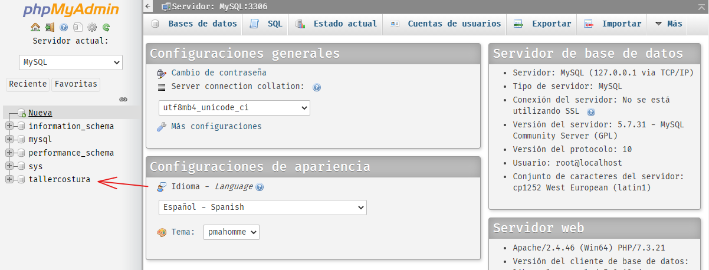
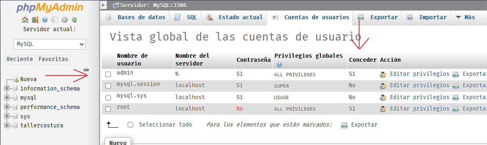
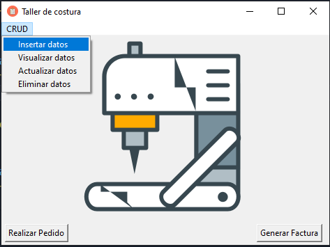
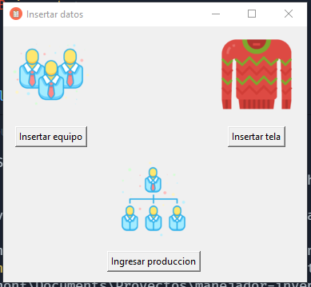
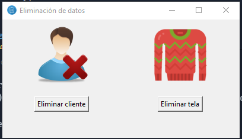
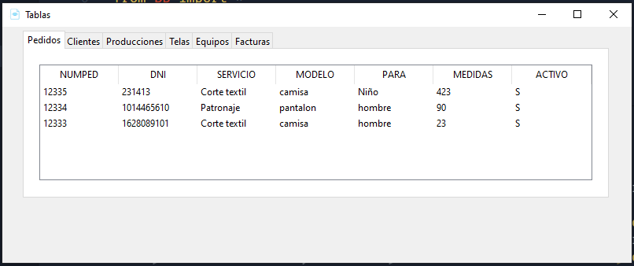
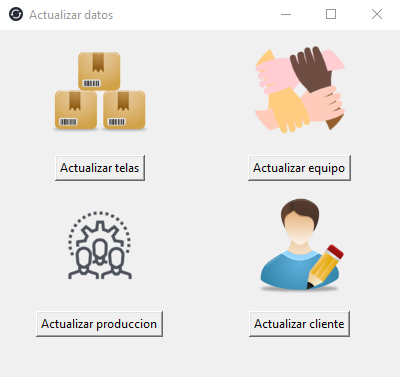

# Manejador de inventario taller de costura
Este es un software que sirve para manejar el inventario en un taller de costura donde en este ingresan telas, pedidos y equipos de producción. El software tiene un CRUD basico y una sección en donde se pueden generar las facturas ó realizar un pedido, tambien incluye una interfaz grafica implementada con Tkinter y como manejador de base de datos use mysql. El software solo funciona en windows 10.

## Requerimientos
Tener instalado Tkinter (por defecto con la instalación de python) , pymysql y Python 3.7 >.  
Puede instalar estas librerias usando el siguiente comando:

```
pip install -r requirements.txt    
```

Tener el servidor de MySql activo, por defecto la conexión en el software es 'localhost', tiene como usuario 'admin' y contraseña '1234', tambien el nombre de la base de datos es 'tallercostura', todos estos aspectos se pueden modificar en el constructor de 'DataBase' en el archivo BB.py.  
En mi caso inicie el servidor con wampserver y en PhpMyAdmin agregue la tabla y al usuario con sus privilegios.  
### base de datos



### usuario




# Funcionamiento

## Inicio



## Ingresar datos



## Eliminar datos



## Visualizar tablas



## Actualizar datos


