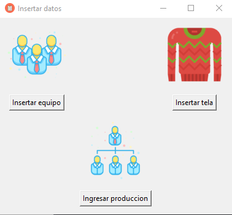
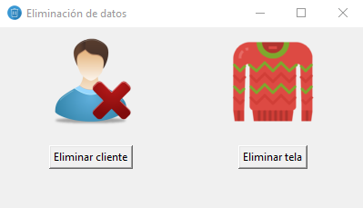
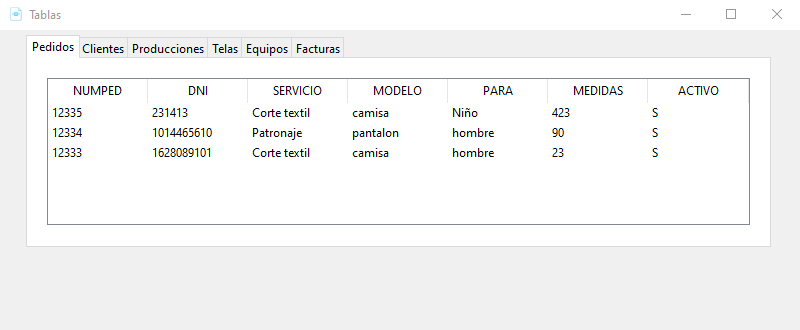

# Manejado de inventario taller de costura
Este es un software que sirve para manejar el inventario en un taller de costura donde en este ingresan telas, pedidos y equipos de producción. El software tiene un CRUD basico y una sección en donde se pueden generar las facturas o realizar un pedido, tambien incluye una interfaz grafica implementada con Tkinter y como manejador de base de datos use mysql. El software solo funciona en windows 10.

## Requerimientos
Tener instalado Tkinter, pymysql y Python 3.7 >.  
Puede instalar estas librerias usando el siguiente comando:

pip install -r requirements.txt

# Funcionamiento

## Inicio

## Ingresar datos

## Eliminar datos

## Visualizar tablas

## Actualizar datos

